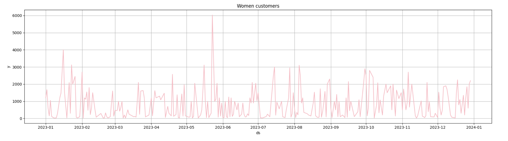
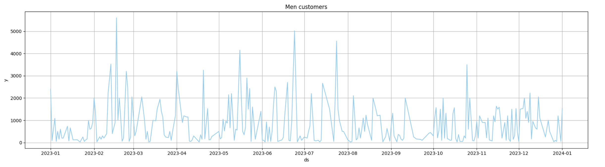
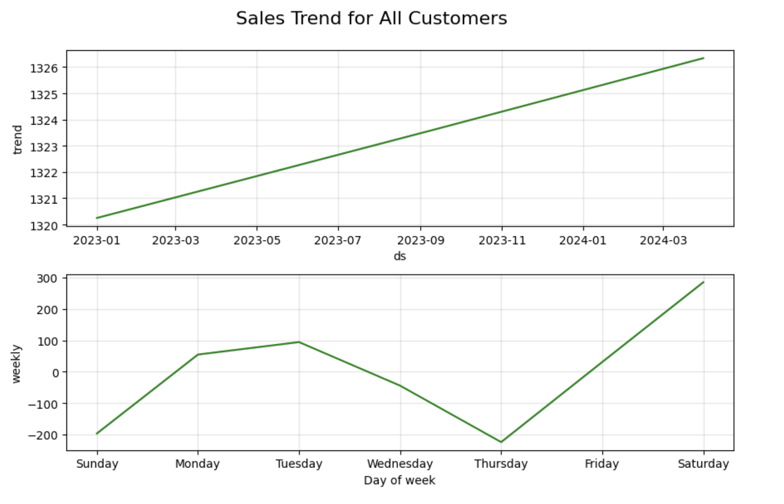
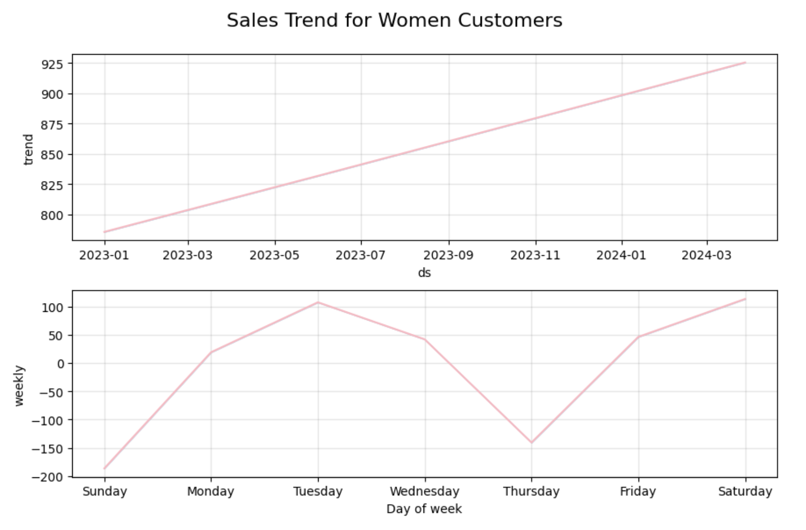
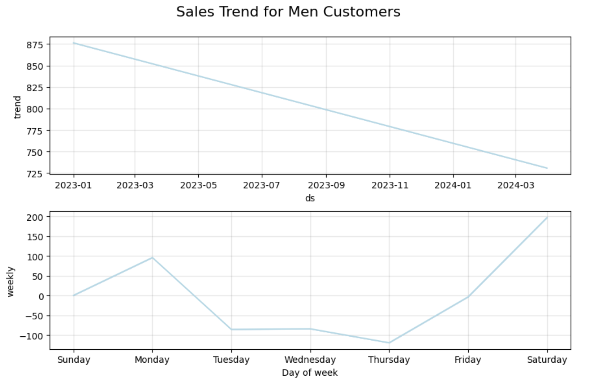

#  🛒 Retail Sales Forecasting with Prophet

> Time series forecasting project analyzing gender-based retail behavior using Facebook Prophet.

---

##  Dataset

**Source**: [Kaggle - Retail Sales Dataset](https://www.kaggle.com/datasets/mohammadtalib786/retail-sales-dataset/data)

- Daily retail transactions including:  
  - `Transaction ID`, `Customer ID`, `Gender`, `Age`, `Category`, `Date`, `Total Amount`
- Used for exploratory analysis and demand forecasting

---

## 🎯 Project Goal

To forecast total daily sales using Facebook Prophet and uncover behavioral differences between male and female shoppers.

---

##  Methodology

1. **Data Cleaning**  
   - Removed unnecessary columns (`Transaction ID`, `Customer ID`)
   - Converted `Date` to datetime, aggregated by day

2. **Segmentation**  
   - Created separate datasets for:
     - All customers
     - Men only
     - Women only

3. **Modeling**  
   - Applied **Prophet** time series model to each segment
   - Forecasted for the next 90 days

4. **Decomposition**  
   - Extracted and visualized:
     - Trend components
     - Weekly seasonal patterns

---

## 📷 Visual Highlights of Sales

###  All customers

###  Female customers

### Male customers

---

##  Results & Analysis

###  All Customers

- **Trend**: Slow upward trend  
- **Weekly Pattern**:  
  -  Best: **Saturday**  
  -  Worst: **Thursday**

---

###  Female Customers

-  **Trend**: Strong upward growth  
-  Weekly highlights:
  - Peak: **Tuesday**, **Saturday**
  - Lowest: **Thursday**
  

- 💡 Suggestion: Promote on Tuesdays; reactivate users Thursdays

---

###  Male Customers

-  **Trend**: Declining over time  
-  Weekly behavior:
  - Peak: **Monday**
  - Lowest: **Thursday–Friday**
  

  
- 💡 Suggestion: Re-engage male shoppers with weekend offers

---

## 📌 Key Takeaways

| Segment        | Trend        | Weekly Peak(s)      | Lowest Day   |
|----------------|--------------|----------------------|--------------|
| All Customers  |  Upward     | Saturday             | Thursday     |
| Female         |  Up         | Tuesday, Saturday    | Thursday     |
| Male           |  **Downward**   | Monday (mild), Sat   | Tuesday–Thursday |

---

## 🚀 Future Improvements

- Add monthly/quarterly trend decomposition
- Forecast by product **category**
- Visualize anomaly spikes in spending
- Deploy as a Streamlit dashboard

